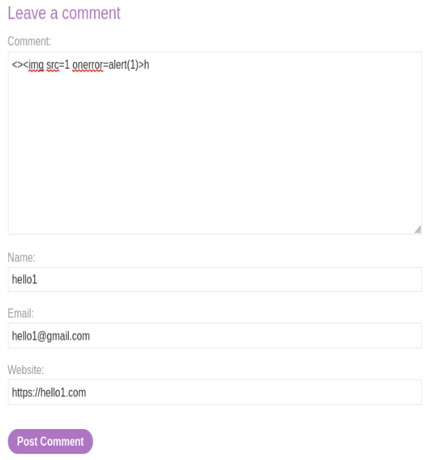

# Stored DOM XSS
 This lab demonstrates a stored DOM vulnerability in the blog comment functionality. To solve this lab, exploit this vulnerability to call the alert() function.
___________________
 References:
 
[https://portswigger.net/web-security/cross-site-scripting/dom-based](https://portswigger.net/web-security/cross-site-scripting/dom-based)
 ____________
 Hah it is possible post a comments:

 

 ______________
This generates the following html code:

 
 _______________

 We can try the payload:
 
</img src=1 onerror=alert()>
 ____________
 
 

 ___________
 It pops like this:

  
 
 
 
